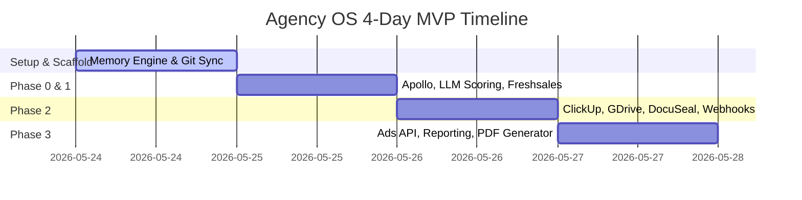

# Agency OS Implementation Plan: Hybrid Python & AIS-OS Architecture

This document provides a critical analysis of the Claude.ai proposed structure and establishes a concrete, risk-mitigated technical blueprint for building the Agency Operating System within a 3-4 day MVP window.

---

## 1. Critical Analysis & The AIS-OS Paradox

### The Core Problem: "No Code" vs "Automation"
The AIS-OS repository is a framework for **human-in-the-loop AI interaction**, designed around Claude Code. It contains no execution runtime, no scheduling, and no API connectors. It is a folder convention and a set of markdown files.
However, the client wants a **real-world event-driven automation system** (e.g., tl;dv webhooks, ClickUp project generation, ad reporting) running autonomously. 

If we attempt to build this purely as "markdown prompts" or "agent thoughts," the system will not work. We must build a **hybrid runtime**:
*   **The Brain/State (AIS-OS Structure)**: Markdown files (`context/`, `memory/`, `decisions/`) acting as a human-readable, Git-versioned database.
*   **The Muscle (Python Engine)**: A lightweight Python CLI and webhook runner that executes the API calls, runs LLM prompts, parses inputs/outputs, and writes/commits the changes to the markdown files.

### Critical Gaps in the Claude-Generated Plan & How to Fix Them

| Claude's Proposed Feature | The Technical Hurdle / Risk | Pragmatic MVP Mitigation |
| :--- | :--- | :--- |
| **LinkedIn Scraping** | Direct scraping via Playwright will trigger LinkedIn's anti-scraping walls, captcha blocks, and lead to account bans within hours of deployment. | **Use Enrichment APIs**: Source/scrape leads using **Apollo.io API** or third-party scraping APIs (e.g., Proxycurl, RapidAPI LinkedIn scrapers) which handle proxy rotation and session headers out of the box. |
| **Git Concurrency Conflicts** | Git is designed for serial, collaborative version control, not as a high-frequency transactional database. Concurrent webhooks (e.g., three tl;dv calls finishing at once) will cause git write collisions and merge conflicts. | **File Lock & Serial Queue**: Use a lightweight Python lock (`filelock` package) to queue all disk writes and commits. Ensure each run does a `git pull --rebase` before writing and `git push` after committing. |
| **Integrations Overload (12 APIs)** | Wiring oauth, keys, and schemas for 12 tools (Freshsales, ClickUp, Instantly, LinkedIn, tl;dv, Google Workspace, Meta, Google, WhatsApp, DocuSeal, HeyGen, ElevenLabs) in 3 days is highly risky. | **API Prioritization Matrix**: Focus strictly on the "high-leverage" loops first. Stub or simulate low-leverage API hooks (e.g., HeyGen, ElevenLabs, WhatsApp) with mock modules for V1. |
| **Token Window Accumulation** | As lead and campaign files grow, feeding entire histories to LLMs on every loop will lead to massive context windows, high costs, and slow execution. | **Strict Schema Bounds**: Implement a markdown parser that only feeds specific header blocks to the LLMs (e.g., only `# Identity` and `# Enrichment` for scoring) instead of the entire document. |

---

## 2. System Architecture

We will structure the repository to maintain strict alignment with the AIS-OS file layout while enabling clean Python execution.

```
/Users/verlianijiteshsunil/Documents/agency-os/
├── .claude/                   # AIS-OS core skills (for manual agent chat)
│   └── skills/
│       ├── onboard/
│       ├── audit/
│       └── level-up/
├── context/                   # Business rules and system prompts
│   ├── agency_profile.md
│   └── active_pipeline.md
├── references/                # Prompt templates & API schemas
│   ├── templates/
│   │   ├── lead_profile.md
│   │   └── client_profile.md
│   └── 3ms-framework.md
├── decisions/
│   └── log.md
├── memory/                    # The markdown database (updated by scripts)
│   ├── leads/
│   ├── clients/
│   └── reports/
├── src/                       # The Python Muscle
│   ├── core/                  # Core modules (Git sync, memory parser)
│   │   ├── git_db.py          # Handles pulling, locking, writing, committing
│   │   └── parser.py          # Serializes/deserializes MD headers to JSON dicts
│   ├── skills/                # Atomic API adapters (pure Python functions)
│   │   ├── apollo.py
│   │   ├── freshsales.py
│   │   ├── clickup.py
│   │   ├── google_drive.py
│   │   ├── docuseal.py
│   │   └── ads_puller.py
│   ├── agents/                # Orchestrators that chain skills and run LLMs
│   │   ├── lead_agent.py      # Lead enrichment, scoring, and CRM upload
│   │   ├── onboarding_agent.py# ClickUp setup, Drive generation, DocuSeal trigger
│   │   └── reporting_agent.py # Narrative analysis and PDF compilation
│   └── webhooks.py            # FastAPI receiver for external webhooks
├── run.py                     # CLI entrypoint
├── requirements.txt           # Package list
└── README.md                  # Operational runbook
```

---

## 3. High-Leverage Workflows & Integration Specs

### Pipeline 1: Lead Intelligence (Phase 0 + Phase 1)
1. **Trigger**: CLI run (`python run.py lead-pipeline --query="..."`) or incoming webhook.
2. **Scrape**: Query Apollo.io API for leads matching target persona.
3. **Deduplicate**: Check `memory/leads/` for matching `email` or `domain`.
4. **Enrich**: Fetch tech stack, funding, and company signals from Apollo.
5. **Score**: Send enriched JSON to Claude/OpenAI via structured JSON prompt. Get 0-100 fit score.
6. **Save**: Write to `memory/leads/{name}-{company}.md` using the canonical schema. Commit to Git.
7. **CRM & Outreach Sync**: If score $\ge 70$, create contact in Freshsales and add to Instantly sequence.

### Pipeline 2: Client Handoff (Phase 2)
1. **Trigger**: Freshsales webhook (`deal.won`).
2. **Verify**: Check if `memory/clients/{client}.md` exists. Create if new.
3. **ClickUp**: Create project from predefined Space template. Return project URL.
4. **Google Drive**: Provision standard folders (Creatives, Briefs, Reports).
5. **DocuSeal**: Generate signature link from onboarding template. Email to client.
6. **Welcome Email**: Trigger personalized email via Gmail/Resend API.
7. **Update Memory**: Update `memory/clients/{client}.md` with ClickUp ID, GDrive folder path, and contract status. Commit to Git.

### Pipeline 3: Campaign & Reporting (Phase 3)
1. **Trigger**: Cron job / scheduled runner.
2. **Metrics Pull**: Query Meta Ads & Google Ads API for the last 7 days of performance.
3. **Anomalies**: Perform basic statistical deviation checks (e.g., CPA spike > 30%).
4. **LLM Narrative**: Feed raw metrics + historical narrative from `memory/reports/` to LLM to write a weekly performance summary.
5. **PDF Render**: Convert the generated markdown file into a PDF using WeasyPrint.
6. **Deliver**: Email report to client contacts listed in `memory/clients/{client}.md`.

---

## 4. 4-Day MVP Implementation Roadmap



### Day 1: Foundation (Scaffolding & Memory Sync Engine)
*   Setup project skeleton and `.env` configuration template.
*   Implement `src/core/git_db.py`: Python wrapper that handles file locking, runs `git pull --rebase` before file updates, writes files, runs `git commit`, and pushes.
*   Implement `src/core/parser.py`: Bi-directional converter between markdown headers (e.g., `## Identity`) and Python dictionary payloads.

### Day 2: Lead Acquisition & Enrichment Pipeline
*   Implement Apollo.io API client for lead fetching and enrichment.
*   Implement `score_lead` using structured output models (Pydantic / Instructor).
*   Wire the CLI command: `python run.py run-leads --query="growth marketers"`
*   Build Freshsales and Instantly API client integrations.

### Day 3: Client Handoff & Webhook Server
*   Implement `src/webhooks.py` using **FastAPI** to receive payload webhooks from Freshsales (`deal.won`).
*   Build the ClickUp API tool (create list/folder from template ID).
*   Build Google Drive integration using a Service Account credential.
*   Build DocuSeal integration for sending contracts automatically.

### Day 4: Reporting Pipeline & Validation
*   Build mock / actual Meta & Google Ads reporting connectors.
*   Create report generation markdown synthesizer.
*   Implement WeasyPrint rendering engine to compile reports to PDF.
*   Run end-to-end integration tests using CLI.

---

## 5. Verification Plan

### Automated Testing
*   Unit tests in `tests/` directory verifying `parser.py` (markdown conversion precision).
*   Integrations test script running mock responses for APIs to test full pipeline executions without burning credits.

### Manual Verification
1.  **Lead Flow Check**: Run CLI lead pipeline, verify that a new markdown file appears in `memory/leads/` with complete details, and that Git history logs the commit.
2.  **Webhook Handoff Check**: Trigger a mock webhook call to `POST /webhooks/freshsales`, verify ClickUp and Drive folders are populated, and the client profile file transitions status in memory.
3.  **PDF Report Check**: Run the report generation script, verify report compiles cleanly to PDF, and layout looks professional.
